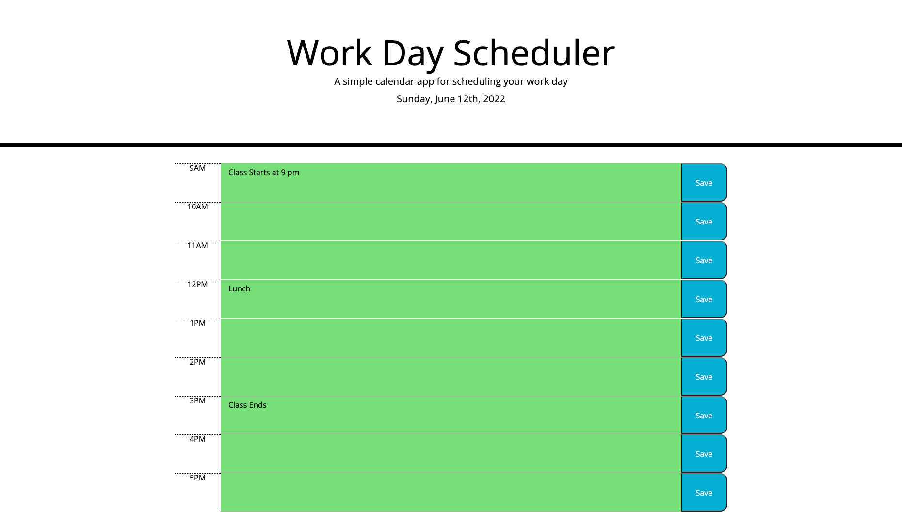

# Work Day Scheduler

## Table of Contents

1. [Description](#description)
2. [Resources](#resources)
3. [Visuals](#visuals)
4. [Author and Aknowledgement](#author-and-aknowledgements)

## Decription

The assignement requires students to create a simple calnder application  that allows users to save events for each hour of the day by modifying given starter code. Students will utilize Moment.js library to work with date and time.

## Resources

-[LIVE SITE](https://github.com/raydover/work-day-scheduler)

-[Repository](https://git@github.com:raydover/work-day-scheduler.git)

## Visuals

## Authors and Acknowledgements

code created by UNCC Bootcamp coders, edited by student Raymond Dover